# RA3.- DEPURACIÓN

Utilizando el código adjunto que implementa un ascensor sigue las siguientes instrucciones. Al final deberás entregar un fichero comprimido "ExDepuradorNombreApellido1Apellido2.rar" con dos ficheros:  

- exDepuradorNombreApellido1Apellido2.pdf (Exportado a pdf desde LibreOffice/Word)
- exDepuradorWorkspaceNombreApellido1Apellido2. (Eclipse)  

Realiza los siguientes pasos:  
-  Abre Eclipse y crea un workSpace nuevo exDepuradorWorkspaceNombreApellido1Apellido2. Añádele el proyecto     "NombreApellido1Apellido2ExDepurador".  

- Añade el los tres paquetes sistemaAscensor, testAscensor y utiles. Se adjunta junto con estas instrucciones.  

- Abre el documento copia de este en un editor de textos. Indica tu nombre y apellidos en la primera línea como autor (busca ** y reemplaza).  

- En el main de TestAscensor refactoriza la variable "ascensor" e identifícala por tu nombre y primer apellido (ascensorPepeBlanco p.ej.)  

1. A.En el fichero pdf debe aparecer tras este párrafo un pantallazo que demuestre este código en la perspectiva Java (Java Browsing).  

  

2. Utiliza el depurador para una ejecución línea a línea que se pare en la primera línea del main.
-  B: En el fichero pdf debe aparecer tras este párrafo un pantallazo que demuestre esta instantánea en la perspectiva del depurador (Debug).  

  

- C: Añade también cómo lo has configurado para que se detenga en la primera línea del main.  

<code>Botón derecho sobre punto de ruptura --> Breakpoint Properties</code>  

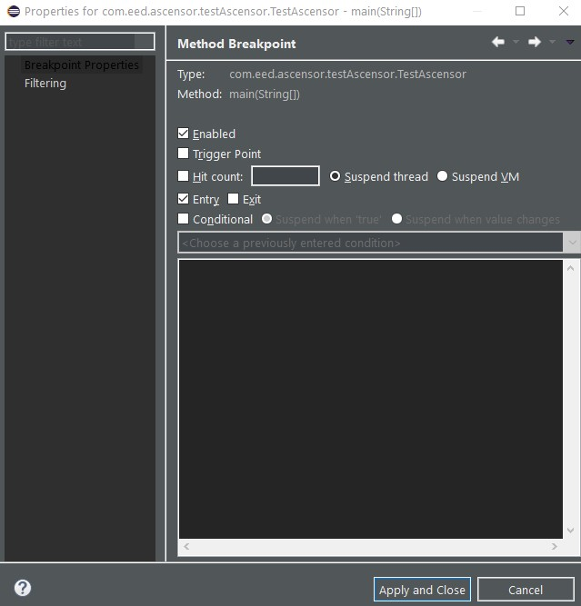  

3. Añade un punto de ruptura en la excepción "NumeroDePlantasInvalidasException"
- D: En el fichero pdf debe aparecer tras este párrafo un pantallazo que demuestres cómo lo has configurado (menú, botón...).  

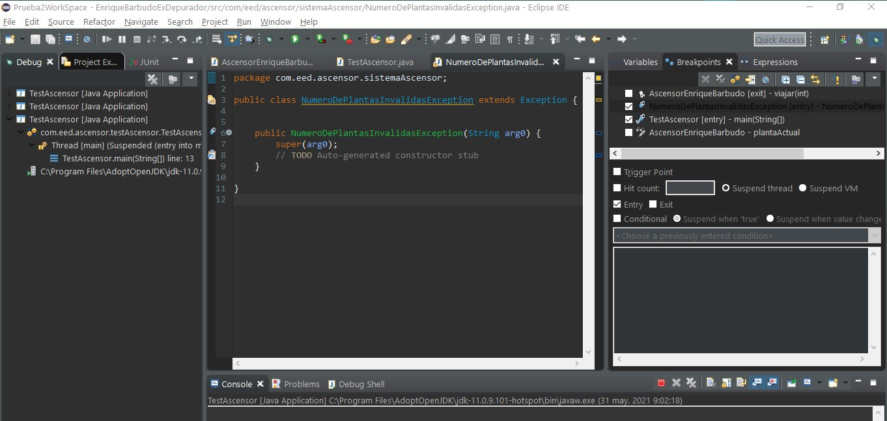

4. Añade un Whatchpoint para cada vez que se modifique el atributo plantaActual de la clase Ascensor(sistemaAscensor.Ascensor)
- E: En el fichero pdf debe aparecer tras este párrafo un pantallazo que demuestres cómo lo has configurado (menú, botón...).  

  

<code>Botón derecho sobre punto de ruptura --> Breakpoint Properties</code> 

   

5. Añade un punto de ruptura a la salida del método viajar.
- F: En el fichero pdf debe aparecer tras este párrafo un pantallazo que demuestres cómo lo has configurado (menú, botón...).  

<code>Botón derecho sobre punto de ruptura --> Breakpoint Properties</code>

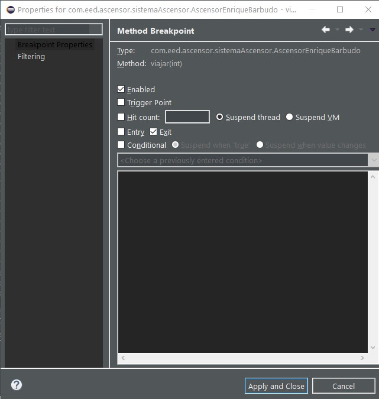  

6. Avanza en la depuración DIRECTAMENTE hasta el siguiente punto de ruptura en la ejecución.  

7. En la primera entrada de datos, la altura del edificio solicitada por teclado será -1.

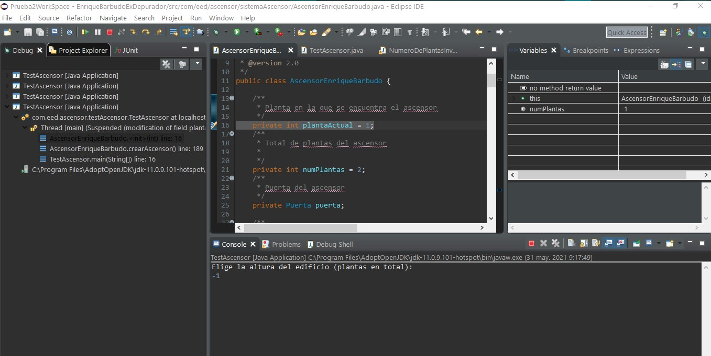  

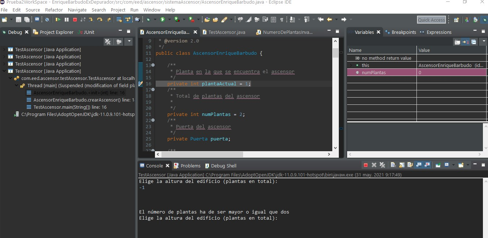  

8. En la segunda entrada de datos, la altura del edificio solicitada por teclado será 3.
- H: Indica las siguientes instantáneas del depurador. Captura la pila de llamadas y las líneas donde se ha parado el depurador.  

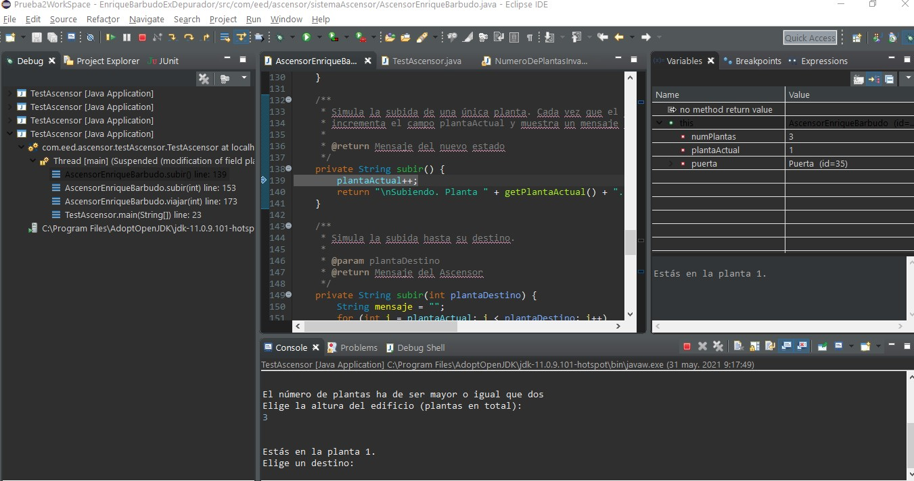  

9. En la tercera entrada de datos, el destino solicitado será 3.
- I: Indica las siguientes instantáneas del depurador. Captura la pila de llamadas y las líneas donde se ha parado el depurador.  

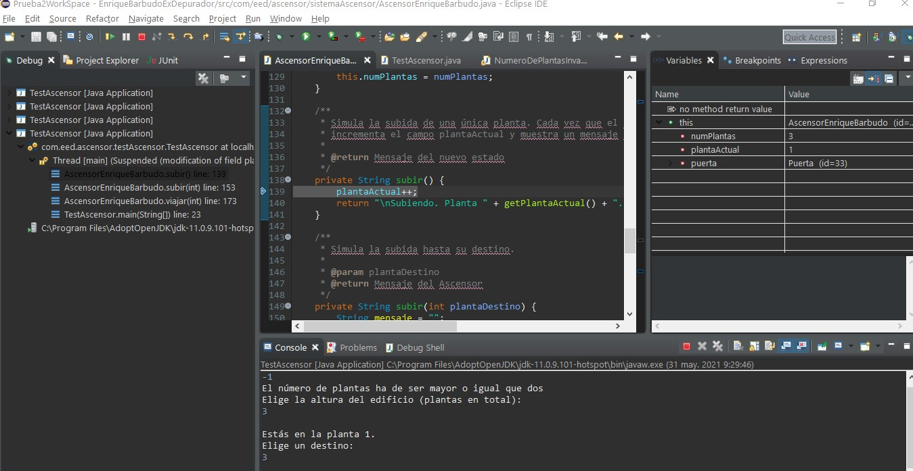  

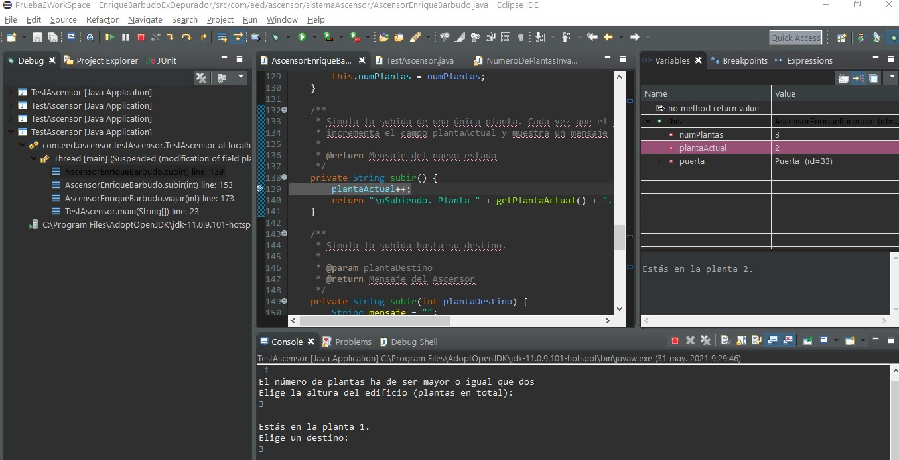  

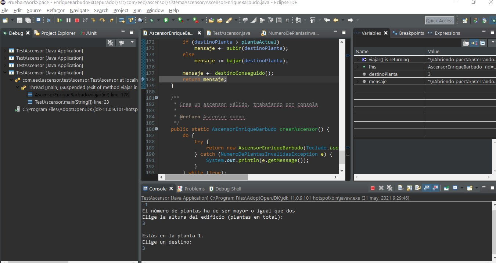  

9. Depurando del código mediante Step Into, llega a la ejecución donde Ascensor.destinoConseguido() invoque a Puerta.abrir()
- J: En el fichero pdf debe aparecer tras este párrafo un pantallazo que muestre la pila con la instantánea, la línea de código y las variables
(númeroPlantas y plantaActual).  

  

- K: Indica en el también la tecla de acceso rápido utilizada.
<code>F5</code>  

10. Configura el filtro para que mediante el Step into no se entre nunca al paquete útiles
- L: En el fichero pdf debe aparecer tras este párrafo un pantallazo que muestre tanto la configuración como la activación del filtrado.  

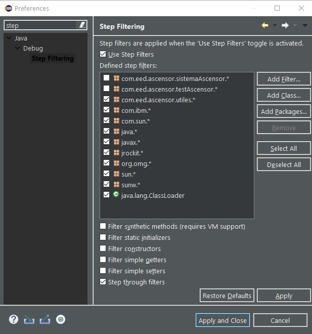  

11. Desde el depurador modifica el contenido del atributo plantaActual a 9 (valor incoherente)
- M: En el fichero pdf debe aparecer tras este párrafo un pantallazo que muestre el nuevo valor ya modificado en la perspectiva del depurador (Debug)  

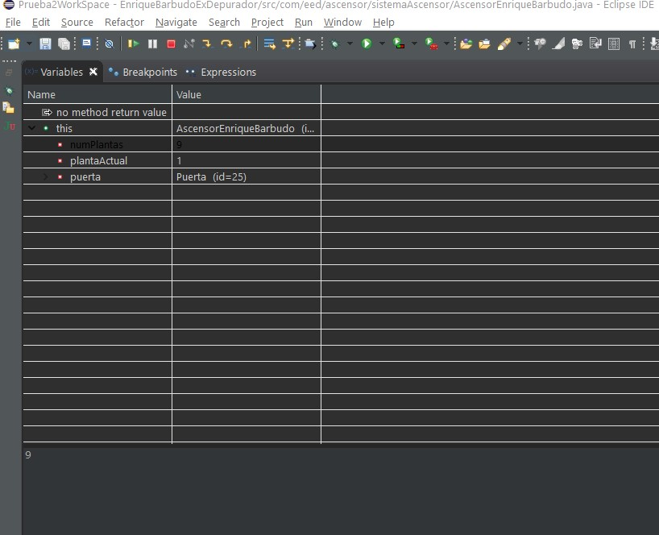  

- N: Una vez finalizada la ejecución, muestra un pantallazo de la consola.  
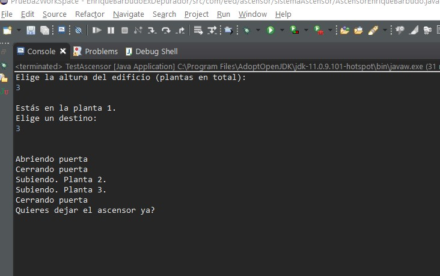  

- Ñ: Una vez finalizada la ejecución, muestra un pantallazo de la vista de todos los breakpoints definidos (sólo los indicados en este examen)  

  

