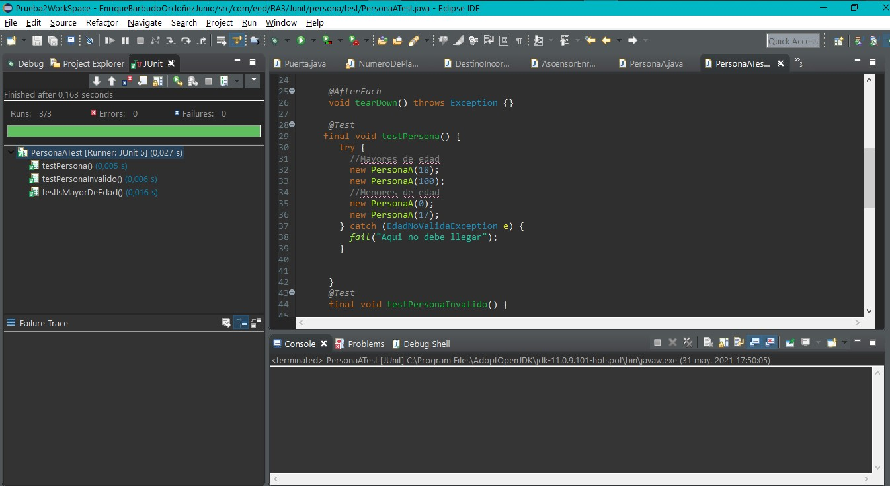

# JUnit Test Case

1. [Código](https://github.com/iesgrancapitan-eed/recuperacion-junio-2021-kiquebarbudo87/tree/main/src/com/eed/RA3/Junit)

2. Descripción de cada prueba/etiqueta  
- [testPersona](https://github.com/iesgrancapitan-eed/recuperacion-junio-2021-kiquebarbudo87/blob/48831dc98d7e0480ed6a56b56cd50d1565676d21/src/com/eed/RA3/Junit/persona/test/PersonaATest.java#L32): Comprueba si es mayor o menor de edad.
- [testPersonaInvalido](https://github.com/iesgrancapitan-eed/recuperacion-junio-2021-kiquebarbudo87/blob/48831dc98d7e0480ed6a56b56cd50d1565676d21/src/com/eed/RA3/Junit/persona/test/PersonaATest.java#L50): Comprueba que la edad de la persona sea positiva y por tanto, real.
- [testIsMayorDeEdad](https://github.com/iesgrancapitan-eed/recuperacion-junio-2021-kiquebarbudo87/blob/48831dc98d7e0480ed6a56b56cd50d1565676d21/src/com/eed/RA3/Junit/persona/test/PersonaATest.java#L67): Comprueba los valores límite de la edad.

3. Referencia el código en cada descripción  

4. Documenta con un pantallazo la realización de las pruebas sin errores.  

  